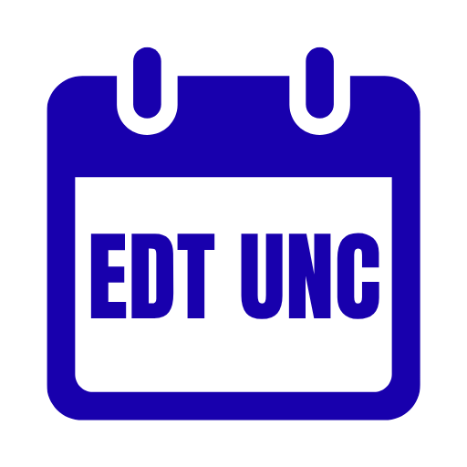

  

<h1 align="center">EDT UNC</h1>

**EDT UNC** est une application Flutter open-source qui permet de consulter l'emploi du temps de l'Université de Nouvelle-Calédonie directement depuis un fichier ICS fourni par le service Web de l’Université en entrant simplement son identifiant.

## Téléchargement

[Dernière version](https://github.com/TooFuW/appli_edt_univ/releases/latest)

**Version Android :**

- Télécharger et installer `EDT_UNC_android.apk` (le Play Store affichera un warning qui sera à ignorer)
- Ou m'envoyer à [eyrianmuet@proton.me](mailto:eyrianmuet@proton.me) l'adresse mail de votre compte Google pour accéder à la version en test fermé sur le Play Store

**Version Windows :**

- Télécharger et extraire `EDT_UNC_windows.zip` puis lancer `appli_edt_univ.exe`

## Fonctionnalités

* Récupération automatique de l'EDT.
* Plusieurs styles d'affichage du calendrier (hebdomadaire / mensuel).
* Mouvements de navigation (swipe droite/gauche).
* Vue détaillée des créneaux horaires pour chaque jour (début/fin des cours).
* Mode hors-ligne : stockage du dernier calendrier de chaque compte connecté pour une consultation sans connexion.
* Multi-comptes : connexions à plusieurs compte en simultané pour passer rapidement d'un compte à l'autre même sans connexion
* Version windows avec une vue hebdomadaire

## Licence

Ce projet est sous licence MIT. Consultez le fichier [LICENSE](LICENSE.md) pour plus d’informations.
